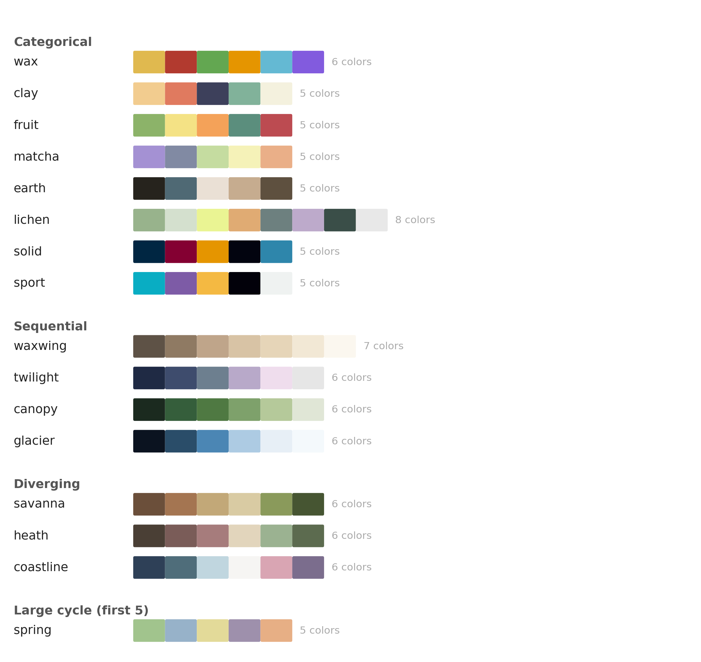

# waxwing

Matplotlib utilities and color palettes for publication-ready figures.

Waxwing applies sensible defaults—clean spines, print-quality DPI, editable PDF fonts, bundled typefaces—so you spend less time fighting Matplotlib and more time on your figures.

## Installation

```bash
pip install waxwing
```

## Quick start

```python
import matplotlib.pyplot as plt
import waxwing

waxwing.set_default_styles()          # apply all defaults at once

fig, ax = plt.subplots()
ax.plot([1, 2, 3], color=waxwing.palettes.clay[1])
waxwing.trim_spines(ax)
plt.savefig("figure.pdf")
```

## Styling

### `set_default_styles()`

Applies the full waxwing style in one call:

| Setting | Value |
|---|---|
| Font | Source Sans 3, 9 pt |
| Figure size | 6.5 × 3 in (single column, papers) |
| Screen DPI | 150 |
| Save DPI | 300 |
| Save bbox | tight |
| PDF/PS font type | 42 (editable in Illustrator) |
| Top/right spines | removed |
| Axis margins | 0 |

You can also set individual properties:

```python
waxwing.set_font("Literata")      # switch to a serif font
waxwing.set_figsize(3.25, 2.5)    # half-column width
```

### `trim_spines(ax=None, keep_right=False, keep_top=False)`

Clips the left and bottom spines to the outermost tick marks, giving a clean floating-axis look. Call after all data and tick configuration is done.

```python
fig, ax = plt.subplots()
ax.plot(x, y)
waxwing.trim_spines(ax)
```

### Fonts

Four variable-weight typefaces are bundled and registered automatically on import:

| Name | Style |
|---|---|
| `"Source Sans 3"` | Neutral sans-serif (default) |
| `"Noto Sans"` | Wide-coverage sans-serif |
| `"Source Serif 4"` | Optical-size serif |
| `"Literata"` | Literary serif |

```python
print(waxwing.list_fonts())
# ['Noto Sans', 'Source Sans 3', 'Source Serif 4', 'Literata']

waxwing.set_font("Source Serif 4")
```

## Color palettes

All palettes live in `waxwing.palettes` and are plain Python lists of hex strings, so they work anywhere Matplotlib accepts a color sequence. YOu can also use them with seaborn.



```python
from waxwing import palettes

ax.plot(x, y, color=palettes.clay[1])
ax.set_prop_cycle(color=palettes.spring)

# seaborn:
sns.color_palette(palettes.savanna)

# reversed colormap:
palettes.waxwing[::-1]
```

### Categorical

| Palette | Colors | Character |
|---|---|---|
| `wax` | 6 | yellow, red, green, gold, blue, violet |
| `clay` | 5 | warm earth tones |
| `fruit` | 5 | vibrant warm hues |
| `matcha` | 5 | muted purples and pastels |
| `earth` | 5 | dark browns and teal |
| `lichen` | 8 | greens, ochre, and lavender |
| `solid` | 5 | bold primaries |
| `sport` | 5 | vivid cyan, purple, gold |

### Sequential (dark → light)

| Palette | Colors | Character |
|---|---|---|
| `waxwing` | 7 | warm taupe → off-white |
| `twilight` | 6 | navy → lavender → grey |
| `canopy` | 6 | forest green → cream |
| `glacier` | 6 | deep blue → near-white |

### Diverging

| Palette | Colors | Character |
|---|---|---|
| `savanna` | 6 | brown ↔ olive green |
| `heath` | 6 | warm brown ↔ cool green |
| `coastline` | 6 | slate blue ↔ mauve |

### Large categorical cycle: `spring`

`spring` contains 31 colors organized in five tonal cycles (vivid → pale → dark → mid → near-black, plus greys). It is designed to support figures with many series while maintaining visual coherence.

```python
ax.set_prop_cycle(color=palettes.spring)
```

## Requirements

- Python ≥ 3.8
- matplotlib
